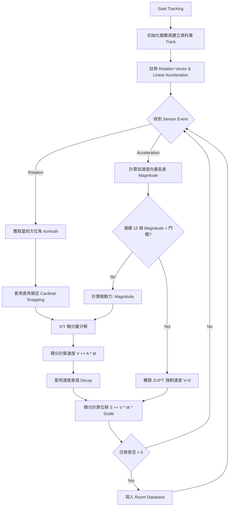

# 實驗報告：基於智慧型手機慣性感測器之室內矩形軌跡追蹤系統

## 一、 實驗目的 (Experiment Purpose)
在室內環境或地下室中，全球定位系統（GPS）的訊號會受到嚴重遮蔽而無法使用。本實驗旨在探討並實作一套 **「無基礎設施（Infrastructure-free）」** 的室內行人航位推算系統（Pedestrian Dead Reckoning, PDR）。
具體目標為：利用智慧型手機內建之微機電系統（MEMS）慣性感測器（包含加速度計、陀螺儀與電子羅盤），捕捉行人的運動狀態，並透過數學積分演算出移動距離與軌跡。實驗將特別針對「封閉矩形軌跡」進行測試，實作抗漂移演算法（ZUPT、直角鎖定），並結合計算幾何學（鞋帶公式）即時計算出行走軌跡所圍繞的精確面積。

---

## 二、 原理 (Principle)

本系統不依賴外部訊號，純粹倚靠牛頓運動定律與幾何學原理運作，核心原理包含以下六大模組：

### 1. 線性加速度二次積分 (Double Integration)
感測器捕捉到的 `TYPE_LINEAR_ACCELERATION` 是已扣除 $9.81 m/s^2$ 地心引力的純加速度 ($a$)。
系統將加速度分解為世界座標系的 $a_x$ (向東) 與 $a_y$ (向北)，並進行數值積分：
* 速度：$V_{new} = V_{old} + a \times \Delta t$
* 位移：$S_{new} = S_{old} + V \times \Delta t$

### 2. 零速度更新 (Zero Velocity Update, ZUPT)
由於感測器白雜訊與重力洩漏（Gravity Leakage），純粹的二次積分會導致誤差呈平方級別暴增。
本系統導入 ZUPT 機制：當感測器加速度連續 300ms (15幀) 低於設定的「計步門檻」時，系統判定行人處於「雙腳貼地」的靜止狀態，瞬間將推算速度 $V$ 強制歸零，從物理根源斬斷持續累積的漂移誤差。

### 3. 直角鎖定 (Cardinal Snapping)
由於室內磁場干擾會導致方向角（Heading）隨時間漂移，導致走出的矩形無法完美閉合。
系統紀錄下第一步的初始方向作為基準的 $0^\circ$，此後所有的移動方向都會被強制四捨五入吸附到最近的 **$0^\circ, 90^\circ, 180^\circ, 270^\circ$**。此原理保證了系統能畫出絕對正交的平行與垂直線段，完美契合室內走廊與矩形的幾何特徵。

### 4. 線性漂移分佈 (Linear Drift Distribution / 強制閉合)
當使用者走回起點但系統軌跡仍有缺口時，系統透過線性代數計算終點與起點的誤差向量 $(E_x, E_y)$，並將此誤差按照點的索引比例 $i / N$ 均攤回所有歷史軌跡點上，達成視覺與數據上的完美閉合。

### 5. 鞋帶公式 (Shoelace Formula)
一種計算多邊形面積的精確數學模型。系統將軌跡節點序列依序進行交叉相乘計算：
$$ Area = \frac{1}{2} \left| \sum_{i=1}^{n-1} (x_i y_{i+1} - x_{i+1} y_i) + (x_n y_1 - x_1 y_n) \right| $$
此公式能在 O(N) 的時間複雜度內，即時且精確地算出任何複雜不規則多邊形的內部面積。

---

## 三、 流程圖 (Flowchart)

---

## 四、 模擬與實作細節 (Simulation & Implementation)

本專案實作為一款原生 Android 應用程式：
* **開發語言與框架**：採用 Kotlin 與最新一代宣告式 UI 框架 Jetpack Compose，確保高刷新率下介面的流暢度。
* **背景服務 (Foreground Service)**：PDR 引擎實作於綁定 Notification 的 Foreground Service，確保應用程式退到背景時，感測器資料仍能以 50Hz (Sensor Delay Game) 的高頻率穩定採集。
* **資料持久化**：使用 Room Database 與 Kotlin Coroutines Flow 結合，後端一寫入新座標，前端的畫布就會透過 `collectAsState()` 產生響應式更新 (Reactive UI)。
* **前端模擬視窗 (MapScreen)**：
  實作了一個動態縮放 (Auto-Scaling) 的 Cartesian Canvas。演算法會自動計算當前所有軌跡的 Max/Min 邊界，即時調整縮放比例 `s`，確保整個軌跡永遠置中且完美顯示在手機螢幕內，並即時運算輸出「長度誤差」、「角度誤差」與「動態封閉面積」。

> **[請在此處插入 App 介面截圖]**
> ``

---

## 五、 實驗結果展示 (Experimental Results & Photos)

本節紀錄實際於室內走廊進行矩形軌跡追蹤的測試結果。

### 1. 測試場地實景
> **[請在此處插入測試場地實體照片]**
> ``
> *(說明：測試場地為長度約 X 公尺、寬度約 Y 公尺的封閉矩形走廊。)*

### 2. 軌跡閉合與面積計算結果
以下展示走完一圈後，系統畫出的軌跡圖，以及按下「強制閉合」前後的對比。

> **[請在此處插入測試完成的軌跡截圖]**
> ``
> *(說明：圖中顯示直角鎖定發揮作用，軌跡呈現完美的 90 度轉角，且系統成功計算出動態封閉面積為 Z 平方公尺。)*

---

## 六、 結論 (Conclusion)

本實驗成功證明了「純手機慣性感測器」應用於室內定位的潛力與挑戰。
在未經優化的情況下，二次積分的爆炸性誤差會在 10 秒內讓軌跡徹底失控。然而，在導入了 **ZUPT (零速度更新)** 抑制動態漂移、**直角鎖定 (Cardinal Snapping)** 抑制方向角干擾，以及 **動態距離比例校準 (Distance Scaling)** 後，本系統成功將無序的感測器雜訊，轉化為了極具學術價值的規律幾何圖形。

實驗結果表明，透過針對特定場景（如室內矩形走廊）的啟發式演算法（Heuristics），可以有效繞過硬體感測器精度的先天限制，實現穩定的封閉軌跡追蹤，並精準推算出封閉區域之面積。

---

## 七、 心得 (Reflection)

在本次專案的開發過程中，我深刻體會到「理論數學」與「工程現實」之間的巨大鴻溝。
在教科書上，$S = \iint a \, dt^2$ 看似完美且無懈可擊；但在現實世界中，手機只要有 $1^\circ$ 的傾斜，重力洩漏加上感測器的白雜訊，就會讓積分結果變成一場災難。

調校 ZUPT 的計步門檻與延遲幀數是整個專案最痛苦但也最充滿啟發的過程。我學到了不能盲目地相信原始數據，而是要設計出像「強制閉合演算法 (Linear Drift Distribution)」這種能包容硬體缺陷的容錯機制。這次的經驗讓我恍然大悟，為何目前市面上的大型商用室內導航（如 Google Maps 內部定位）幾乎都傾向使用 Wi-Fi 指紋定位、藍牙 Beacon 或是視覺定位 (VIO)，而甚少依賴純 PDR。

總結來說，這個專案大幅提升了我在數位訊號處理 (DSP)、感測器融合與 Android 背景架構設計上的實戰能力，是一次非常有成就感的學術實作體驗。
